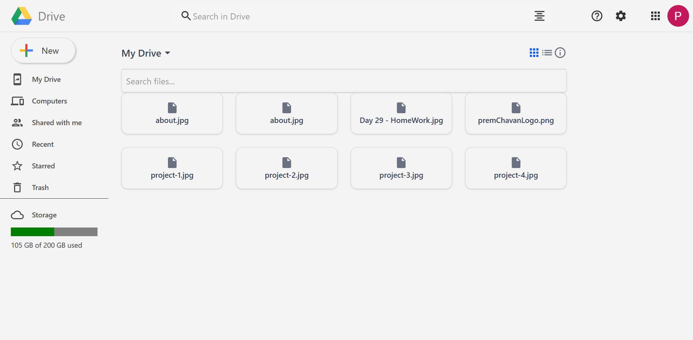

# Google Drive Clone 🚀

A fully functional Google Drive clone built using **React (Vite)**, **Firebase** for authentication and real-time database, and **Cloudinary** for file uploads. Styled with **Tailwind CSS** for a modern and responsive UI.

## 🔗 Live Demo

👉 [Visit the hosted site](https://react-g-drive-clone.vercel.app/)

## 📸 Landing Page
<table>
  <tr>
    <td align="center"><br>Login Page</td>
    <td align="center"><br>Dashboard</td>
  </tr>
</table>

## ✨ Features

- 🔐 Firebase Authentication (Login / Logout)
- ☁️ Cloudinary File Upload
- 📂 File Storage using Firebase Realtime Database
- 📁 Folder structure (simulate directory-like experience)
- 📎 View uploaded files
- 🎨 Responsive UI with Tailwind CSS
- ⚡ Built with Vite for fast development

## 🔧 Tech Stack

- **Frontend:** React + Vite
- **Styling:** Tailwind CSS
- **Authentication & Database:** Firebase
- **File Uploads:** Cloudinary

## 📦 Installation

```bash
# Clone the repo
git clone https://github.com/PremGChavan/React-G-Drive-Clone
cd google-drive-clone 

# Install dependencies
npm install

# Start development server
npm run dev
